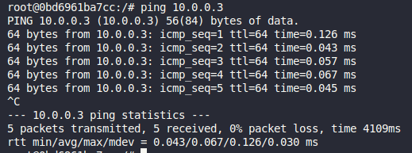

# Terceira Avaliação - 13/01/2025 : 20/01/2024 - Redes de Computadores II

Equipe:

- MAURICIO BENJAMIN DA ROCHA : 20219016147
- PEDRO ANTONIO VITAL DE SOUSA CARVALHO : 20219029753

Objetivos

- Faça um relatório (how-to) descrevendo todos os passos.
  - Deixe bem claro o que você fez.  
  - Descreva sequencialmente todos os processos requisitados nas questões.
  - Não basta colocar as imagens, descreva todas as figuras no relatório.
  - Relatório em PDF.
- Faça um vídeo explicando e demonstrando o desenvolvimento, publicar o vídeo no YouTube e adicionar o link no arquivo resposta.  
  - verificar se o vídeo tem áudio.
- O que enviar no arquivo:
  - relatório;
  - link do vídeo

## Questão  Única:  Utilizando  Docker  crie  a  infraestrutura  abaixo  e  faça  o  que  se pede a seguir


De acordo com a infraestrutura a cima, realize as operações numeradas a baixo

### 1. Instanciar a rede ilustrada na Figura utilizando o docker. Utilize a imagem do ubuntu em todas os hosts; (1pt)

Para instanciar a infraestrutura apresentada, usaremos técnicas de engenharia de software para estruturar de forma organizada e eficiente todos os containers docker que usaremos.

#### Passo 1. Estruturar o Projeto

Crie uma pasta para o projeto, onde todos os arquivos relacionados ao projeto serão adicionados nela. Neste guia usaremos a pasta `infra` para isso, conforme ilustrado a baixo.

```bash
infra/

```

Dentro da pasta `infra` iremos criar um arquivo `docker-compose.yaml` para gerenciar nossos containers de forma mais organizada e reprodutível.

```bash
infra/
    docker-compose.yaml
```

Iremos dividir a infraestrutura em partes, usando o conceito de módulos, de forma que teremos 3 módulos principais: `Rede A` `Firewall` e `Rede B`. Para isso criaremos respectivamente as pastas `net-a`, `net-b` e `firewall` conforme apresentado a baixo.

```bash
infra/
    docker-compose.yaml
    firewall/
    net-a/
    net-b/
```

Conforme apresentando na Figura, precisamos de 3 componentes essenciais em cada rede, sendo eles `servidor dns`, `servidor web` e `computadores hosts`. Iremos criar respectivamente em cada pasta de rede, 3 novas pastas, sendo elas `dns`, `web` e `host` respectivamente conforme apresentado a baixo.

```bash
infra/
    docker-compose.yaml
    firewall/
    net-a/
        dns/
        host/
        web/
    net-b/
        dns/
        host/
        web/
```

Visando ter um maior controle sobre as imagens docker para nosso containers, iremos usar um `dockerfile` customizado para componente da nossa rede.

Dentro de cada uma das pastas`host`, crie um `dockerfile` com o seguinte conteúdo:

```dockerfile
FROM ubuntu:latest

RUN apt-get update && apt-get update -y && apt-get install -y curl && apt-get install iputils-ping -y && apt-get install net-tools -y

CMD ["sh", "-c", "sleep infinity"]
```

```bash
infra/
    docker-compose.yaml
    firewall/
    net-a/
        dns/
        host/
            dockerfile
        web/
    net-b/
        dns/
        host/
            dockerfile
        web/
```

O `dockerfile` irá garantir que os containers dos hosts serão construídos usando uma imagem do Linux `ubuntu` com algumas dependências customizadas de ferramentas para testar a rede como `ping`, `ifconfig` e etc.

Para o `servidor dns` iremos usar uma imagem do servidor dns `bind9` baseada o ubuntu, mas com alguns ajustes nossos que iremos fazer no futuro. Crie docker files para os servidores dns e os coloque em suas respectivas pastas com base nos exemplos a baixo:

Conteúdo do dockerfile

```dockerfile
FROM ubuntu/bind9:latest

RUN apt-get update -y && apt-get install -y dnsutils

ENV TZ=UTC

EXPOSE 53/tcp 53/udp

CMD ["sh", "-c", "sleep infinity"]
```

Estrutura do projeto ao adicionar os docker files de `dns`

```bash
infra/
    docker-compose.yaml
    firewall/
    net-a/
        dns/
            dockerfile
        host/
            dockerfile
        web/
    net-b/
        dns/
            dockerfile
        host/
            dockerfile
        web/
```

Agora vamos ao ultimo componente que iremos customizar, o nosso `servidor web`. Para o servidor web foi escolhido o `nginx` por ser um servidor web muito usado no mercado de trabalho, tornando-se acessível a um grande volume de guias e tutoriais na internet para ajudar a configurá-lo. Se deseja saber mais sobre ele, recomendo que de uma olhada nas referencias usadas neste trabalho. Deixando as enrolações de lado, use o conteúdo a baixo para criar cada `dockerfile` para as pastas da web

```dockerfile
FROM nginx:latest

CMD ["nginx", "-g", "daemon off;"]

```

Não se preocupe que iremos adicionar e configurar uma pagina web customizada para o dockerfile apresentar futuramente, mas por hora apenas adicione os docker files em suas respectivas pastas, obtendo o seguinte resultado.

```bash
infra/
    docker-compose.yaml
    firewall/
    net-a/
        dns/
            dockerfile
        host/
            dockerfile
        web/
            dockerfile
    net-b/
        dns/
            dockerfile
        host/
            dockerfile
        web/
            dockerfile
```

Terminamos de preparar temporariamente o necessário para nossas redes, agora vamos configurar o nosso `firewall`. Para configurar a imagem do firewall, iremos precisar de alguns recursos que serão abordados em questões futuras, portanto iremos apenhas preparar o mínimo e terminar a tarefa quando "sua hora chegar". Crie um `dockerfile` para o `firewall` com o seguinte conteúdo:

```dockerfile
FROM ubuntu:latest

RUN apt-get update && apt-get install -y \
    iproute2 iptables iputils-ping \
    && echo "net.ipv4.ip_forward=1" >> /etc/sysctl.conf \
    && apt-get clean

CMD ["sh", "-c", "sysctl -p && tail -f /dev/null"]
```

Ao final teremos o seguinte resultado

```bash
infra/
    docker-compose.yaml
    firewall/
        dockerfile
    net-a/
        dns/
            dockerfile
        host/
            dockerfile
        web/
            dockerfile
    net-b/
        dns/
            dockerfile
        host/
            dockerfile
        web/
            dockerfile
```

Agora temos a estrutura base para trabalhar com todos os componentes da nossa rede!

Vamos estruturar nossa rede usando nosso arquivo `docker-compose.yaml` para instanciar os containers que iremos precisar, aproveitando os arquivos `dockerfile` para termos nossas imagens customizadas para facilitar nossas vidas.

```yaml
networks:
  subnet-A:
    driver: bridge
    ipam:
      config:
        - subnet: 10.0.0.0/24

  subnet-B:
    driver: bridge
    ipam:
      config:
        - subnet: 20.0.0.0/24

services:
  firewall:
    build:
      context: ./firewall
    container_name: firewall
    cap_add:
      - NET_ADMIN  # Permissões para manipular as configurações de rede
    sysctls:
      net.ipv4.ip_forward: "1"  # Habilitar roteamento de pacotes
    networks:
      subnet-A:
        ipv4_address: 10.0.0.5
      subnet-B:
        ipv4_address: 20.0.0.5
  # Rede A
  host1-net-a:
    build: 
      context: ./net-a/host
    container_name: host1-net-a
    networks:
      subnet-A:
        ipv4_address: 10.0.0.2
    dns:
      - 10.0.0.20
  host2-net-a:
    build: 
      context: ./net-a/host
    container_name: host2-net-a
    networks:
      subnet-A:
        ipv4_address: 10.0.0.3
    dns:
      - 10.0.0.20
  dns-a:
    build: 
      context: ./net-a/dns
    container_name: dns-a
    ports:
      - "30051:53"
      - "30051:53/udp"
    networks:
      subnet-A:
        ipv4_address: 10.0.0.20
  web-a:
    build: 
      context: ./net-a/web
    container_name: web-a
    networks:
      subnet-A:
        ipv4_address: 10.0.0.10
    ports:
      - "8051:80"
  # Computadores Subrede B
  host1-net-b:
    build: 
      context: ./net-b/host
    container_name: host1-net-b
    networks:
      subnet-B:
        ipv4_address: 20.0.0.2
    dns:
      - 20.0.0.20
  host2-net-b:
    build: 
      context: ./net-b/host
    container_name: host2-net-b
    networks:
      subnet-B:
        ipv4_address: 20.0.0.3
    dns:
      - 20.0.0.20
  web-b:
    build: 
      context: ./net-b/web
    container_name: web-b
    networks:
      subnet-B:
        ipv4_address: 20.0.0.10
    ports:
    - "8052:80"
  dns-b:
    build: 
      context: ./net-b/dns
    container_name: dns-b
    ports:
      - "30052:53"
      - "30052:53/udp"
    networks:
      subnet-B:
        ipv4_address: 20.0.0.20
```

Fique tranquilo que vamos discutir o `docker-compose.yaml` passo a passo!

- **networks:** Iremos construir nossas redes neste bloco, para atender as subredes a e b da Figura
  - *subnet-A:*
    - Usa o driver bridge para criar uma rede de ponte.
    - Configurada com o intervalo de endereços IP 10.0.0.0/24.
  - *subnet-B:*
    - Também usa o driver bridge.
    - Configurada com o intervalo de endereços IP 20.0.0.0/24.
- **Services:** Containers que estarão em execução no nosso projeto
  - *firewall:* Representa o Firewall da arquitetura
    - Constrói a partir do contexto firewall no dockerfile que criamos para ele.
    - Nome do container: firewall.
    - Adiciona a capacidade NET_ADMIN para manipular configurações de rede.
    - Habilita o roteamento de pacotes com net.ipv4.ip_forward: "1".
    - Conectado a subnet-A com o IP 10.0.0.5 e a subnet-B com o IP 20.0.0.5.
  - *host1-net-a:* Representa o host1 da subrede A
    - Constrói a partir do dockerfile no contexto ./net-a/host.
    - Nome do container: host1-net-a.
    - Conectado a subnet-A com o IP 10.0.0.2.
    - Usa o DNS 10.0.0.20.
  - *host2-net-a:* Representa o host2 da subrede A
    - Constrói a partir do dockerfile contexto ./net-a/host.
    - Nome do container: host2-net-a.
    - Conectado a subnet-A com o IP 10.0.0.3.
    - Usa o DNS 10.0.0.20.
  - *dns-a:* Representa o servidor DNS que fica responsável pela subrede A
    - Constrói a partir do contexto dns.
    - Nome do container: dns-a.
    - Mapeia as portas 30051:53 e 30051:53/udp.
    - Conectado a subnet-A com o IP 10.0.0.20.
  - *web-a:* Representa o servidor WEB que fica responsável pela subrede A
    - Constrói a partir do contexto web.
    - Nome do container: web-a.
    - Conectado a subnet-A com o IP 10.0.0.10.
    - Mapeia a porta 8051:80.
  - *host1-net-b:* Representa o host1 da subrede B
    - Constrói a partir do contexto ./net-b/host.
    - Nome do container: host1-net-b.
    - Conectado a subnet-B com o IP 20.0.0.2.
    - Usa o DNS 20.0.0.20.
  - *host2-net-b:* Representa o host2 da subrede B
    - Constrói a partir do contexto ./net-b/host.
    - Nome do container: host2-net-b.
    - Conectado a subnet-B com o IP 20.0.0.3.
    - Usa o DNS 20.0.0.20.
  - *web-b:* Representa o servidor WEB que fica responsável pela subrede B
    - Constrói a partir do contexto web.
    - Nome do container: web-b.
    - Conectado a subnet-B com o IP 20.0.0.10.
    - Mapeia a porta 8052:80.
  - *dns-b:* Representa o servidor DNS que fica responsável pela subrede B
    - Constrói a partir do contexto dns.
    - Nome do container: dns-b.
    - Mapeia as portas 30052:53 e 30052:53/udp.
    - Conectado a subnet-B com o IP 20.0.0.20.

*obs:* Voce pode estar se perguntando "E os switchs?", fique calmo que vou te explicar!

No Docker, o driver de rede `bridge` atua como um `switch virtual` que conecta os containers dentro da mesma rede. No nosso arquivo `docker-compose.yaml`, as redes `subnet-A` e `subnet-B` usam o driver bridge, o que significa que cada rede tem seu próprio switch virtual

- subnet-A: Todos os containers conectados a subnet-A (como host1-net-a, host2-net-a, dns-a, web-a) estão conectados a um switch virtual criado pelo driver bridge.
- subnet-B: Todos os containers conectados a subnet-B (como host1-net-b, host2-net-b, dns-b, web-b) estão conectados a outro switch virtual criado pelo driver bridge.

Portanto, o driver bridge do Docker atua como o switch que conecta os componentes da rede subnet-A internamente.

Com toda a explicação realizada, vamos testar se realmente funcionou a criação da nossa infraestrutura!

Anote estes comando, pois serão importantes para testar e visualizar o projeto!
**obs:** Para o meu sistema operacional `Linux Ubuntu 24.04` eu uso o comando `docker compose` para interagir com meu arquivo `docker-compose.yaml`, mas caso não funcione para você, tente usar `docker-compose`, pois em alguns sistemas operacionais, vai funcionar somente desse jeito.

- `docker compose up -d --build` : É o comando docker usado para executar a infraestrutura modelada pelo arquivo `docker-compose.yaml`, além de atualizar sempre que você fizer alguma alteração nos seus arquivos `dockerfile`
- `docker compose down` : É o comando usado para encerrar a infraestrutura, tanto para manutenção quanto para casos de exclusão de containers.
- `docker exec it "CONTAINER" "COMANDO"` :É o comando usado para executar um container de modo interativo, permitindo pedir que ele execute uma ação e retorne o resultado em nosso terminal. Será extremamente útil para testes, simulações e ajustes finos caso precisemos.
- `docker ps` : É o comando usado para listar no terminal, todos os containers em execução, onde podemos usar `docker ps -a` para listar todos os containers, incluido os parados.

Dito isso, vamos `buildar` nossa infraestrutura com base no `docker-compose.yaml`

- Abra seu terminal na pasta do projeto
- Use o `comando docker compose up -d --build`

Você irá visualizar algo semelhante a Figura a baixo:


Aguarde terminar a construção.

Quando terminar, use `docker ps` e veja que todos os containers que queriamos criar, foram criados e estão semelhantes a Figura a baixo.


### 2. Atribuir endereço IPs nos hosts de forma que seja respeitado a subrede. Usar máscara de rede de 24 bits. Sub-rede A= 10.0.0.0; Sub-rede B=20.0.0.0; (1pt)

Se observamos bem o `docker-compose.yaml`, pode-se reparar que os hosts tem seu endereço ipv4 definido, além de estarem nos intervalos corretos conforme solicitado na questão.

```yaml
networks:
  subnet-A:
    driver: bridge
    ipam:
      config:
        - subnet: 10.0.0.0/24

  subnet-B:
    driver: bridge
    ipam:
      config:
        - subnet: 20.0.0.0/24

services:
  firewall:
    build:
      context: ./firewall
    container_name: firewall
    cap_add:
      - NET_ADMIN  # Permissões para manipular as configurações de rede
    sysctls:
      net.ipv4.ip_forward: "1"  # Habilitar roteamento de pacotes
    networks:
      subnet-A:
        ipv4_address: 10.0.0.5
      subnet-B:
        ipv4_address: 20.0.0.5
  # Rede A
  host1-net-a:
    build: 
      context: ./net-a/host
    container_name: host1-net-a
    networks:
      subnet-A:
        ipv4_address: 10.0.0.2
    dns:
      - 10.0.0.20
  host2-net-a:
    build: 
      context: ./net-a/host
    container_name: host2-net-a
    networks:
      subnet-A:
        ipv4_address: 10.0.0.3
    dns:
      - 10.0.0.20
  dns-a:
    build: 
      context: ./net-a/dns
    container_name: dns-a
    ports:
      - "30051:53"
      - "30051:53/udp"
    networks:
      subnet-A:
        ipv4_address: 10.0.0.20
  web-a:
    build: 
      context: ./net-a/web
    container_name: web-a
    networks:
      subnet-A:
        ipv4_address: 10.0.0.10
    ports:
      - "8051:80"
  # Computadores Subrede B
  host1-net-b:
    build: 
      context: ./net-b/host
    container_name: host1-net-b
    networks:
      subnet-B:
        ipv4_address: 20.0.0.2
    dns:
      - 20.0.0.20
  host2-net-b:
    build: 
      context: ./net-b/host
    container_name: host2-net-b
    networks:
      subnet-B:
        ipv4_address: 20.0.0.3
    dns:
      - 20.0.0.20
  web-b:
    build: 
      context: ./net-b/web
    container_name: web-b
    networks:
      subnet-B:
        ipv4_address: 20.0.0.10
    ports:
    - "8052:80"
  dns-b:
    build: 
      context: ./net-b/dns
    container_name: dns-b
    ports:
      - "30052:53"
      - "30052:53/udp"
    networks:
      subnet-B:
        ipv4_address: 20.0.0.20
```

Para garantir que as subredes estão sendo respeitadas, podemos usar o comando `ping` para testar a comunicação entre os containers, usando o seguinte processo

- Use o comando `docker exec -it host1-net-a bash` para acessar o terminal do container `host1-net-a` que é nosso `host1 da rede A` e tente pingar o container `host2 da rede A` atráves do seu endereço IP que é `10.0.0.3`
- Use `ping 10.0.0.3`
- Observe a Figura a baixo e veja que estamos sim conseguindo comunicação com o `host2` que está na mesma rede que o `host1`



Agora se tentarmos nos comunicar com outro host da rede `B` não iremos conseguir, por causa que as subredes estão sendo respeitadas, e até que o firewall esteja pronto para intermediar a comunicação, não haverá comunicação entre redes!


### 3. Instalar e configurar o Servidor web, onde: na sub-rede A deve-se expor a página [www.empresa-a.com](www.empresa-a.com) e na sub-rede B deve expor a página [www.empresa-b.com](www.empresa-b.com) (1pt)

Para Instalar e configurar de forma personalizada nosso servidor web `nginx`, iremos precisar de alguns arquivos e configurações adicionais. Inicialmente vamos criar a página que nossos servidores web irão expor.

Para o servidor web da rede A, usaremos o seguinte conteúdo para o arquivo html

```html
<!DOCTYPE html>
<html lang="pt-BR">
<head>
    <meta charset="UTF-8">
    <meta name="viewport" content="width=device-width, initial-scale=1.0">
    <title>empresa-a</title>
</head>
<body>

    <h1>Empresa A</h1>
    <p>Olá, seja bem-vindo a empresa A.</p>
    <p>Estamos felizes em te receber.</p>
    
</body>
</html>
```

Copie o conteúdo a cima em um arquivo `index.html` e o salve na pasta `web` da rede `A` conforme apresentando a baixo.

```bash
infra/
    docker-compose.yaml
    firewall/
        dockerfile
    net-a/
        dns/
            dockerfile
        host/
            dockerfile
        web/
            dockerfile
            index.html
    net-b/
        dns/
            dockerfile
        host/
            dockerfile
        web/
            dockerfile
```

Agora vamos repetir o processo para a pasta `web` da rede `B`!

Para o servidor web da rede `B`, usaremos o seguinte conteúdo para o arquivo html

```html
<!DOCTYPE html>
<html lang="pt-BR">
<head>
    <meta charset="UTF-8">
    <meta name="viewport" content="width=device-width, initial-scale=1.0">
    <title>empresa-b</title>
</head>
<body>

    <h1>Empresa B</h1>
    <p>Olá, seja bem-vindo a empresa B.</p>
    <p>Estamos felizes em te receber.</p>
    
</body>
</html>
```

Copie o conteúdo a cima em um arquivo `index.html` e o salve na pasta `web` da rede `B` conforme apresentando a baixo.

```bash
infra/
    docker-compose.yaml
    firewall/
        dockerfile
    net-a/
        dns/
            dockerfile
        host/
            dockerfile
        web/
            dockerfile
            index.html
    net-b/
        dns/
            dockerfile
        host/
            dockerfile
        web/
            dockerfile
            index.html
```

**OBS** : Fique a vontade para usar o arquivo HTML que preferir, pois o usado neste guia é apenas um exemplo.

Agora vamos precisar de arquivo de configuração para que nossos servidores web `A` e `B` estejam prontos para "ouvir" pedidos pelas páginas atráves de respectivamente [www.empresa-a.com](www.empresa-a.com) e [www.empresa-b.com](www.empresa-b.com)

Para o servidor web da rede `A`, crie o arquivo `empresa-a.com.conf` e insira o seguinte conteúdo

```nginx
server {
    listen 80;
    server_name www.empresa-a.com;

    root /usr/share/nginx/html;
    index index.html;

    location / {
        try_files $uri $uri/ =404;
    }
}
```

Uma breve explicação sobre o bloco a cima:

- **server** { ... }: Define um bloco de configuração de servidor virtual.
- **listen 80;**: Especifica que o servidor deve escutar na porta 80, que é a porta padrão para HTTP.
- **server_name [www.empresa-a.com](www.empresa-a.com);**: Define o nome do servidor (domínio) que este bloco de configuração deve atender.
- **root /usr/share/nginx/html;**: Define o diretório raiz onde os arquivos do site estão localizados.
- **index index.html;**: Define o arquivo padrão a ser servido quando um diretório é requisitado.
- **location / { ... }**: Define um bloco de localização para a raiz do site (/).
- **try_files $uri $uri/ =404;**: Tenta servir o arquivo requisitado ($uri). Se não encontrado, tenta servir como diretório ($uri/). Se ainda não encontrado, retorna erro 404.

Este bloco de configuração é usado para configurar o Nginx para servir um site estático localizado em /usr/share/nginx/html para o domínio [www.empresa-a.com](www.empresa-a.com).

Observe que teremos adicionar nosso arquivo index.html neste diretório do container `/usr/share/nginx/html`

Nossa estrutura de diretórios ficará desta forma:

```bash
infra/
    docker-compose.yaml
    firewall/
        dockerfile
    net-a/
        dns/
            dockerfile
        host/
            dockerfile
        web/
            dockerfile
            empresa-a.com.conf
            index.html
    net-b/
        dns/
            dockerfile
        host/
            dockerfile
        web/
            dockerfile
            index.html
```

Agora vamos repetir o processo para o servidor web da rede `B`, onde usaremos a configuração a baixo:

```nginx
server {
    listen 80;
    server_name www.empresa-b.com;

    root /usr/share/nginx/html;
    index index.html;

    location / {
        try_files $uri $uri/ =404;
    }
}
```

Iremos colocar o conteúdo a cima no arquivo `empresa-b.com.conf` do servidor web da rede `B`

Nossa estrutura de diretórios ficará desta forma:

```bash
infra/
    docker-compose.yaml
    firewall/
        dockerfile
    net-a/
        dns/
            dockerfile
        host/
            dockerfile
        web/
            dockerfile
            empresa-a.com.conf
            index.html
    net-b/
        dns/
            dockerfile
        host/
            dockerfile
        web/
            dockerfile
            empresa-b.com.conf
            index.html
```

Para encerrar as configurações do servidor web (mais ainda não a questão) iremos ajustar nossos arquivos `dockerfile` de `web`, tanto para a rede `A` quanto para a `B`

Atualmente o `dockerfile` de ambos os servidores web está assim:

```dockerfile
FROM nginx:latest

CMD ["nginx", "-g", "daemon off;"]
```

Iremos modificalos para que o mesmo copie tanto nosso arquivo de configurações quanto nossa página html.

`Servidor Web da Rede A`

```dockerfile
FROM nginx:latest

COPY ./index.html /usr/share/nginx/html
COPY ./empresa-a.com.conf /etc/nginx/conf.d/

CMD ["nginx", "-g", "daemon off;"]
```

`Servidor Web da Rede B`

```dockerfile
FROM nginx:latest

COPY ./index.html /usr/share/nginx/html
COPY ./empresa-b.com.conf /etc/nginx/conf.d/

CMD ["nginx", "-g", "daemon off;"]
```

Agora vamos fazer um pequeno teste (que vai dar errado) com os servidores web
